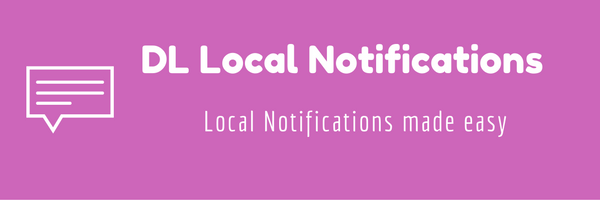

<p align="center">
  
</p>


[![Swift Version][swift-image]][swift-url]
[][podLink]

[](https://travis-ci.org/d7laungani/DLLocalNotifications)
[![License][license-image]][license-url]

In IOS 10, apple updated their library for Notifications and separated Local and push notifications to a new framework:

[User Notifications](https://developer.apple.com/reference/usernotifications)

This library makes it easy to setup a local notification and also includes easy configuration for repeating notifications using [ .None, .Minute, .Hourly, .Daily, .Monthly, .Yearly] .

It also includes all the new features, including inserting attachments and changing the launch image of a notification.

1. [Features](#features)
2. [Requirements](#requirements)
3. [Installation](#installation)
    - [CocoaPods](#cocoapods)
    - [Manually](#manually)
4. [Usage](#usage)
    - [Single Fire Notification](#single-fire-notification)
    - [Repeating Notification starting at a Date](#repeating-notification-starting-at-a-date)
    - [Notification that repeats from one Date to another with a time interval period](#notification-that-repeats-from-one-date-to-another-with-a-time-interval-period)
    - [Modifying elements of the notification](#modifying-elements-of-the-notification)
    - [Location Based Notification](#location-based-notification)
    - [Action Buttons](#adding-action-buttons-to-a-notification)
5. [Contribute](#contribute)

## Features

- [x] Easily Repeat Notifications
- [x] Location Based Notifications
- [x] Category Action buttons
- [x] Queue to enforce 64 notification limit

## Requirements

- iOS 10.0+
- Xcode 8.0+

## Installation

#### CocoaPods
You can use [CocoaPods](http://cocoapods.org/) to install `DLLocalNotifications` by adding it to your `Podfile`:

```ruby
platform :ios, '10.0'
use_frameworks!

target 'MyApp' do
	pod 'DLLocalNotifications'
end
```
Note: your iOS deployment target must be 10.0+

## Usage

### Single fire notification (any date)

Notification that repeats from one Date to another with a time interval period

Note: If you want the notification to repeat then you need to create a 
notification based on date components

```swift

// The date you would like the notification to fire at
let triggerDate = Date().addingTimeInterval(300)

let firstNotification = DLNotification(identifier: "firstNotification", alertTitle: "Notification Alert", alertBody: "You have successfully created a notification", date: triggerDate)

let scheduler = DLNotificationScheduler()
scheduler.scheduleNotification(notification: firstNotification)
scheduler.scheduleAllNotifications()
```

### Repeating Notification based on date components

The configuration of the repetition is chosen in the repeats parameter that can be [ .none, .minute, .hourly, .daily, .monthly, .yearly] .

```swift

// The date you would like the notification to fire at :35 mins every hour

var dateComponents = DateComponents()
dateComponents.minute = 35
dateComponents.second = 0

let firstNotification = DLNotification(identifier: "hourlyNotification", alertTitle: "Notification Alert", alertBody: "You have successfully created a notification", fromDateComponents: dateComponents, repeatInterval: .hourly)

let scheduler = DLNotificationScheduler()
scheduler.scheduleNotification(notification: firstNotification)
scheduler.scheduleAllNotifications()
```

### Notification that repeats from one Date to another with a time interval period

This is useful to setup notifications to repeat every specific time interval for in a specific time period of the day.
```swift

let scheduler = DLNotificationScheduler()

// This notification repeats every 15 seconds from a time period starting from 15 seconds from the current time till 5 minutes from the current time

scheduler.repeatsFromToDate(identifier: "First Notification", alertTitle: "Multiple Notifications", alertBody: "Progress", fromDate: Date().addingTimeInterval(15), toDate: Date().addingTimeInterval(300) , interval: 15, repeats: .none )
scheduler.scheduleAllNotifications()

```
Note: Since this library takes care of the 64 notification limit you would want to call scheduler.scheduleAllNotifications() in your AppDelegate file as well.

### Modifying elements of the notification

You can modify elements of the notification before scheduling. Publically accessible variables include:

repeatInterval, alertBody, alertTitle, soundName, fireDate, attachments, launchImageName, category

```swift

let firstNotification = DLNotification(identifier: "firstNotification", alertTitle: "Notification Alert", alertBody: "You have successfully created a notification", date: Date(), repeats: .minute)

// You can now change the repeat interval here
firstNotification.repeatInterval = .yearly

// You can add a launch image name
firstNotification.launchImageName = "Hello.png"

let scheduler = DLNotificationScheduler()
scheduler.scheduleNotification(notification: firstNotification)
scheduler.scheduleAllNotifications()
```
### Location Based Notification

The notification is triggered when a user enters a geo-fenced area.

```swift

let center = CLLocationCoordinate2D(latitude: 37.335400, longitude: -122.009201)
let region = CLCircularRegion(center: center, radius: 2000.0, identifier: "Headquarters")
region.notifyOnEntry = true
region.notifyOnExit = false

let locationNotification = DLNotification(identifier: "LocationNotification", alertTitle: "Notification Alert", alertBody: "You have reached work", region: region )

let scheduler = DLNotificationScheduler()
scheduler.scheduleNotification(notification: locationNotification)
scheduler.scheduleAllNotifications()
```

### Adding action buttons to a notification

```swift

 let scheduler = DLNotificationScheduler()

 let standingCategory = DLCategory(categoryIdentifier: "standingReminder")

 standingCategory.addActionButton(identifier: "willStand", title: "Ok, got it")
 standingCategory.addActionButton(identifier: "willNotStand", title: "Cannot")

 scheduler.scheduleCategories(categories: [standingCategory])

```
Don't forget to the set the notification category before scheduling the notification using

```swift
notification.category = "standingReminder"
```

### Cancelling a notification

```swift

 scheduler.cancelNotification(notification: notification)


```


## Contribute

We would love for you to contribute to **DLLocalNotifications**, check the ``LICENSE`` file for more info.

## Meta

Devesh Laungani – [@d7laungani](https://twitter.com/d7laungani)

Distributed under the MIT license. See ``LICENSE`` for more information

[https://github.com/d7laungani/](https://github.com/d7laungani/)

[Hire Me](http://deveshlaungani.com/)

[swift-image]:https://img.shields.io/badge/swift-4.2-orange.svg
[swift-url]: https://swift.org/
[license-image]: https://img.shields.io/badge/License-MIT-blue.svg
[license-url]: LICENSE
[podLink]:https://cocoapods.org/pods/DLLocalNotifications
